# AI Tourism Platform

An advanced AI-powered tourism platform built with the MERN stack (MongoDB, Express, React, Node.js). This platform provides real-time tracking, safety alerts using Geofencing, chat capabilities, and AI-driven planning.

## Tech Stack

- **Frontend**: React (Vite), Tailwind CSS, Socket.io-client, React Leaflet (Maps)
- **Backend**: Node.js, Express, Socket.io (Real-time), Google Generative AI (Gemini)
- **Database**: MongoDB
- **Tools**: Docker, Docker Compose

## Prerequisites

- **Docker Desktop** (if running via Docker)
- **Node.js** (v18+ if running locally)
- **MongoDB** (local instance or Atlas URI if running locally)

## Getting Started (Docker)

The easiest way to run the application is using Docker.

1.  Ensure **Docker Desktop** is running.
2.  Navigate to the project root.
3.  Create a `.env` file in the `server/` directory (see Configuration below).
4.  Run the following command:

```bash
docker-compose up --build
```

This will start:
- **Client**: `http://localhost:5173`
- **Server**: `http://localhost:5000`
- **MongoDB**: `localhost:27017`

To stop the containers:
```bash
docker-compose down
```

## Getting Started (Local Development)

If you prefer to run services individually without Docker:

### 1. Database
Ensure your local MongoDB is running on port `27017`.

### 2. Server (Backend)
```bash
cd server
npm install
npm run dev
```
The server will start on port `5000`.

### 3. Client (Frontend)
```bash
cd client
npm install
npm run dev
```
The client will start on port `5173`.

## Configuration

### Server Environment Variables
Create a file named `.env` in the `server/` directory with the following keys:

```env
MONGO_URI=mongodb://localhost:27017/ai_tourism_db
PORT=5000
JWT_SECRET=your_jwt_secret_key
SMTP_HOST="smtp.gmail.com"
SMTP_PORT=587
SMTP_EMAIL="your_email@gmail.com"
SMTP_PASSWORD="your_app_password"
FROM_EMAIL="your_email@gmail.com"
ADMIN_SECRET_CODE=ADMIN_7788
```

## Configuring Ports (Dynamic Ports)

You can run the application on any ports you choose by modifying the `.env` file in the **project root** (next to `docker-compose.yml`).

Example root `.env`:
```env
CLIENT_PORT=3000   # Frontend will be at localhost:3000
SERVER_PORT=8080   # Backend will be at localhost:8080
MONGO_PORT=27018   # Database will be at localhost:27018
```

After changing these values, restart Docker:
```bash
docker-compose down
docker-compose up --build
```

## Comprehensive Feature Suite

### 1. Advanced Authentication & Security System
*   **Multi-Layered Login**:
    *   **Password/Passwordless**: Users can log in via standard credentials or request a magic link/OTP.
    *   **Email OTP Verification**: All sensitive actions (Login, Registration) are verified via a 6-digit Time-based One-Time Password sent via `Gmail`.
    *   **Admin "God Mode" Lock**: Admin access is strictly guarded by a server-side `ADMIN_SECRET_CODE` environment variable. Even with correct credentials, access is denied without this code.
    *   **2-Factor Authentication (2FA)**: Implements `Speakeasy` (TOTP) to generate QR codes compatible with **Google Authenticator**. This adds a rotating 30-second token requirement for high-security accounts.
    *   **Identity Verification (Aadhaar)**: 
        *   Uses **Verhoeff Algorithm** (presumed) or checksum validation for Aadhaar numbers.
        *   Allows document upload (handled by `Multer`) for Admin review.

### 2. Real-Time Geospatial Engine
*   **Live Tracking (Socket.io)**:
    *   **Client**: Browsers emit `updateLocation` events every few seconds.
    *   **Server**: Broadcasts these updates to the `admin-room` via WebSockets, allowing sub-second latency tracking.
*   **Geofencing & Danger Zones**:
    *   **Logic**: Uses **MongoDB Geospatial Queries** (`$local` / `$geoIntersects`) and client-side Haversine distance checks.
    *   **Trigger**: When a user's coordinate falls within a defined `DangerZone` circle (Location + Radius), an alert is triggered.
    *   **Visuals**: Maps render red circles for danger zones using `React-Leaflet` vectors.

### 3. AI-Powered Tourism (Google Gemini)
*   **Travel Genie**:
    *   **Model**: Integrated with **Google Gemini 1.5 Flash/Pro** models.
    *   **Context Awareness**: The AI is prompted to act as a local expert, taking inputs like Budget, Duration, and Interests.
    *   **Output**: Generates structured Markdown itineraries that are parsed and rendered beautifully on the frontend.
*   **Itinerary Management**: Users can save AI-generated plans to their profile (Stored in MongoDB `plans` collection).

---

## Technical Workflows & Data Flow

### 1. User Registration & Role Allocation
**Endpoint**: `POST /api/auth/register` -> `POST /api/auth/complete-registration`

1.  **Initiation**: User submits details. System checks `User` collection for duplicate `email`, `mobile`, or `aadhaarNumber`.
2.  **OTP Challenge**: System generates a crypto-random 6-digit OTP, hashes it (or stores temp), and emails it. Use token `registrationToken` to maintain state stateless.
3.  **Verification**: User submits OTP.
4.  **Role Logic**:
    ```javascript
    const isFirstUser = await User.countDocuments({}) === 0;
    const role = isFirstUser ? 'admin' : 'tourist';
    ```
5.  **ID Generation**: Assigns a unique `touristId` (e.g., `TRST-839210`).

### 2. The Login Sequence (Security Heavy)
**Endpoint**: `POST /api/auth/login` -> `POST /api/auth/verify-otp` -> `POST /api/auth/verify-admin-code`

1.  **Credential Check**: Validate Email/Password.
2.  **Step 2 (OTP)**: Force OTP verification for all users.
3.  **Step 3 (Role Fork)**:
    *   **Tourist**: If `2FA` is enabled, require TOTP token. Else, issue **JWT (JSON Web Token)**.
    *   **Admin**: **STOP**. Require `Admin Secret Code`.
        *   If Code matches `.env.ADMIN_SECRET_CODE`: Issue Admin JWT.
        *   If Mismatch: Return `401 Unauthorized`.

### 3. Safety & Emergency Workflow
**Events**: `socket.emit('SOS')`, `socket.emit('location_update')`

1.  **Trigger**: Tourist clicks the floating **SOS Button**.
2.  **Payload**: Browser captures `navigator.geolocation` (Lat/Lng) + Timestamp + UserID.
3.  **Transmission**: Data sent via Socket.io to the server.
4.  **Broadcast**: Server identifies all connected sockets in room `admin`.
5.  **Alert**: Admin Dashboard triggers a loud audio alarm and focuses the map on the distressed user.
6.  **Persistence**: usage of `Notification` model to store the alert for history.

---

## Exceptions, Validations & Error Handling

### Backend Validations (Mongoose & Joi)
*   **Duplicate Key Errors**:
    *   **Scenario**: User tries to register with an existing Email.
    *   **Result**: Database throws `E11000 duplicate key error`. Controller catches and returns `400: User already exists`.
*   **Data Integrity**:
    *   **Geospatial**: `location.coordinates` MUST be `[Longitude, Latitude]`. Inverted coordinates check prevents "Location on Mars" errors.
*   **File Uploads**:
    *   **Filter**: Only `req.file.mimetype` matching `image/jpeg` or `image/png` are allowed.
    *   **Size Limit**: Files > 5MB are rejected by middleware.

### Frontend Guardrails
*   **Route Protection**:
    *   Wrappers `<ProtectedRoute role="admin">` check the decoded JWT role.
    *   If a Tourist tries to access `/admin/dashboard`, they are forcibly redirected to `/dashboard`.
*   **Session Expiry**:
    *   JWTs have a strict lifetime (e.g., 24h).
    *   `Axios Interceptors` catch `401 Token Expired` responses to auto-logout the user.

---

## System Architecture Diagram

## System Architecture Diagram



```mermaid
sequenceDiagram
    autonumber
    actor User as 👤 User (Tourist/Admin)
    participant Client as 💻 Client (React/Vite)
    participant Server as ⚙️ Express Server
    participant Socket as 🔌 Socket.io Layer
    participant DB as 🗄️ MongoDB (GeoJSON)
    participant AI as 🧠 Google Gemini
    participant Mail as 📧 NodeMiler

    Note over User, DB: 🔐 **Phase 1: Deep Authentication Flow**
    User->>Client: Enter Credentials
    Client->>Server: POST /api/auth/login
    Server->>DB: Validate User & Hash
    
    alt Credentials Invalid
        Server-->>Client: ❌ 401 Unauthorized
    else Credentials Valid
        Server->>Mail: 📨 Send OTP Email
        Server-->>Client: ✅ 200 OK (OTP Sent)
        
        User->>Client: Submit OTP
        Client->>Server: POST /api/auth/verify-otp
        
        alt Role == ADMIN
            Server-->>Client: 🛡️ Request ADMIN_SECRET_CODE
            User->>Client: Input Secret Code
            Client->>Server: POST /verify-admin-code
            Server-->>Client: 🎫 Issue JWT Token
        else Role == TOURIST
            opt 2FA Enabled
                Server-->>Client: 🔐 Request TOTP (Auth App)
                User->>Client: Input 6-digit Code
                Client->>Server: POST /verify-2fa
            end
            Server-->>Client: 🎫 Issue JWT Token
        end
    end

    Note over User, Socket: 🌍 **Phase 2: Real-Time Spatial Engine**
    
    loop Every 10 Seconds (Heartbeat)
        Client->>Client: Get navigator.geolocation
        Client->>Socket: 📡 emit('updateLocation', coords)
        
        par Parallel Processing
            Socket->>DB: Update User Location
            Socket->>Socket: (Admin Room) broadcast('touristMoved')
        and Geofencing Check
            Socket->>DB: Query $geoIntersects (DangerZones)
            alt Inside Danger Zone?
                DB-->>Socket: Match Found!
                Socket-->>Client: ⚠️ emit('DANGER_ALERT')
                Client-->>User: 🚨 TRIGGER ALARM / MODAL
                Socket-->>Client: (Admin) Update Marker to RED
            end
        end
    end

    Note over User, AI: 🤖 **Phase 3: AI Travel Generation**
    User->>Client: "Plan a 3-day trip to Jaipur for less than ₹10k"
    Client->>Server: POST /api/chat/ask
    Server->>Server: Construct Context (Profile + History)
    Server->>AI: ⚡ generateContent(Prompt)
    AI-->>Server: Return Structured Markdown
    Server-->>Client: Render Itinerary Response
    User->>Client: Click "Save Trip"
    Client->>DB: Save to 'Plans' Collection
```

## Database Schema Overview

| Collection | Description | Key Fields |
| :--- | :--- | :--- |
| **Users** | Stores auth & profile data | `email`, `password`, `role`, `aadhaarNumber`, `otp` |
| **Destinations** | Tourist spots data | `name`, `location (GeoJSON)`, `images`, `rating` |
| **DangerZones** | Unsafe areas | `location`, `radius`, `severity` |
| **Feedbacks** | User reviews | `user_id`, `destination`, `rating`, `comment` |


